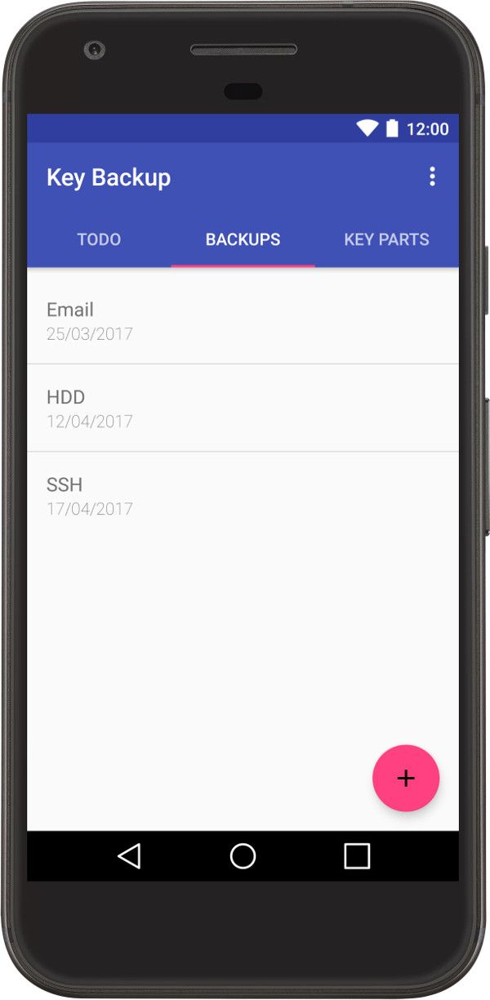

# Free Usable Cryptographic Key Backup

Encryption is used for example for emails, backups mass storages, Bitcoin. If the private key used for the decryption is lost, the encrypted data such as emails are inaccessible. This Android app helps users to backup and restore keys easily and securely without the need for a password.

## How does it work?

1. The app creates a public and a private key at its first start. To guarantee that backups cannot be revealed by stealing the phone the private key is split into multiple parts which the user transfers to friends.
2. Backups will be encrypted using the public key. This way multiple copies of it can be stored at arbitrary places, e.g. at a cloud service or printed as a qr code in a folder. If one copy is stolen, attackers do not get access to the backed up key due to the missing private key. Moreover, the user is still able to access the backup via another copy at a different place.
3. To recover an encrypted backup the private key is needed. Only a subset of the key parts must be collected from friends to recreate the private key.

## Build

This project uses [SecureKeyBackup](https://github.com/tobiasschuelke/SecureKeyBackup) and [SecureKeyBackupAndroid](https://github.com/tobiasschuelke/SecureKeyBackupAndroid). To build this project you need to get these submodules with:

``git submodule update --init --recursive``
